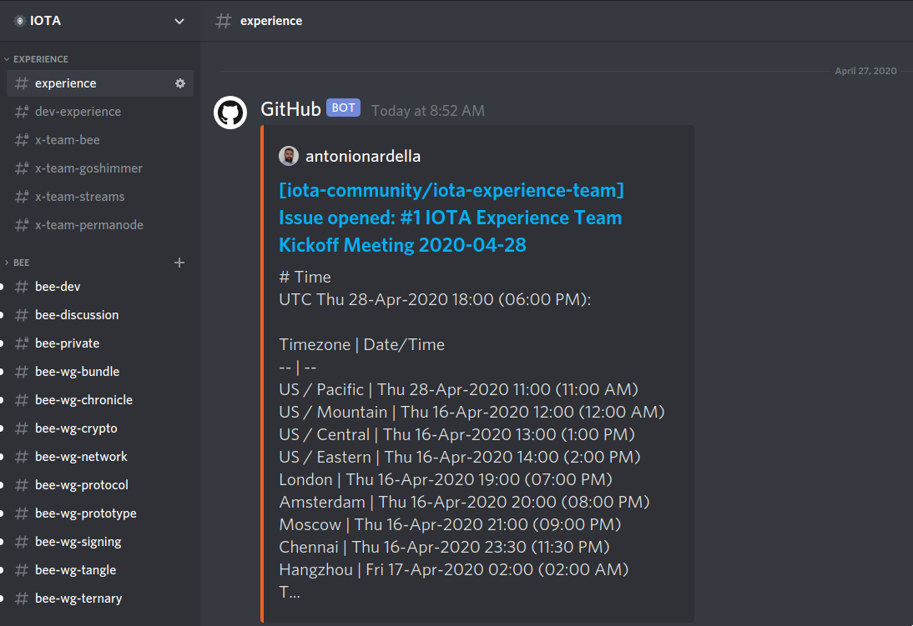
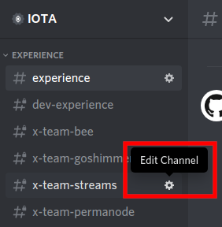
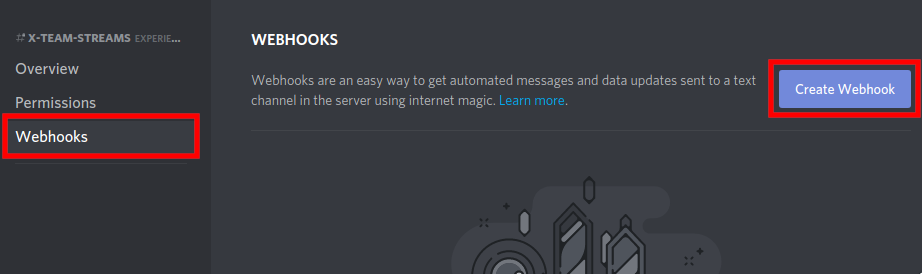
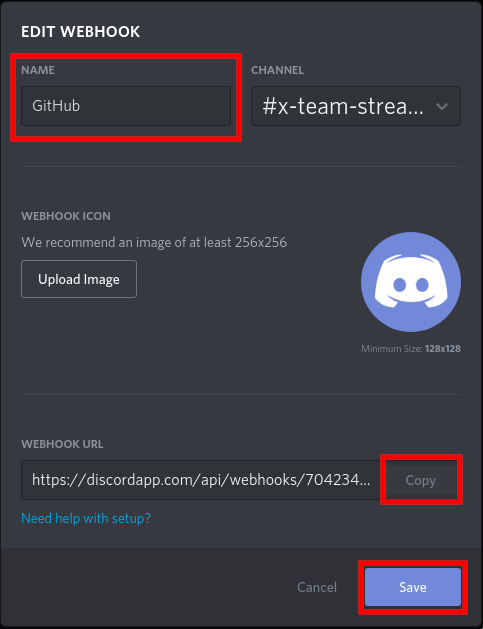
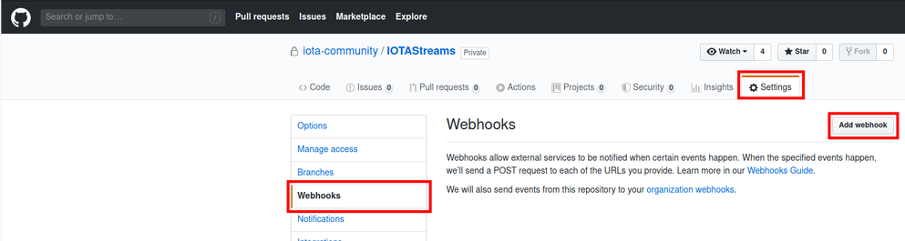
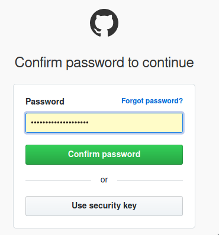
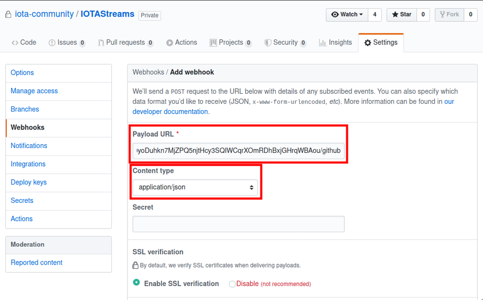
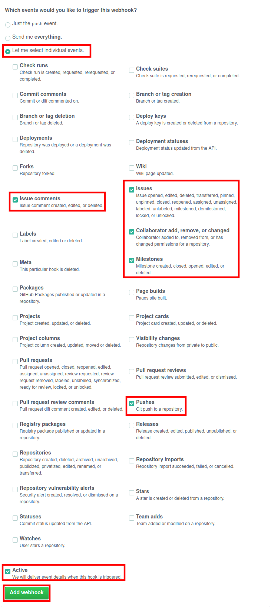
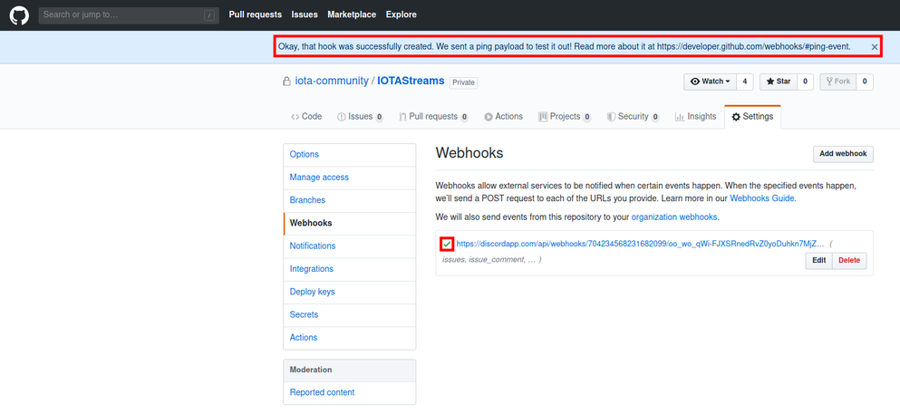

---

---

# GitHub Webhooks to Discord

This guide explains how to get issues from GitHub into the IOTA Experience Team channels.
Every IOTA Experience Team Initiative is assigned a GitHub repository in the iota-community group. It is possible to set up webhooks, to cross-communicate initiatives and events from GitHub to Discord.  
*example*:

## Instructions

In **this example** we will set up the webhook for the **IOTA Streams Experience Team**.

1. Go to the X-Team relative channel in Discord and **Edit Channel**  
   

2. Clieck on **Webhooks** on the left side and then on the **Create Webhook** button on the right side
   

3. Change the name to **GitHub**, click on the **Copy** button to copy the webhook link and click on the **Save** button, to save this settings. *(e.g. of this webhook link:* [*https://discordapp.com/api/webhooks/704234568231682099/oo_wo_qWi-FJXSRnedRvZ0yoDuhkn7MjZPQ5njtHcy3SQIWCqrXOmRDhBxjGHrqWBAou*](https://discordapp.com/api/webhooks/704234568231682099/oo_wo_qWi-FJXSRnedRvZ0yoDuhkn7MjZPQ5njtHcy3SQIWCqrXOmRDhBxjGHrqWBAou)*)*

4. Now we go to the IOTA Experience Team - IOTA Streams GitHub repository  
   https://github.com/iota-community/iotastreams 

5. Here we click on **Settings**, then **Webhooks** and finally the **Add webhook** button
   

6. Insert your password to confirm  
   

7. In the **Payload URL** field we insert the **webhook link** we copied **from Discord** and add **/github** at the end.

   If the link was:
   https://discordapp.com/api/webhooks/704234568231682099/oo_wo_qWi-FJXSRnedRvZ0yoDuhkn7MjZPQ5njtHcy3SQIWCqrXOmRDhBxjGHrqWBAou  
   
   Now it is:
   https://discordapp.com/api/webhooks/704234568231682099/oo_wo_qWi-FJXSRnedRvZ0yoDuhkn7MjZPQ5njtHcy3SQIWCqrXOmRDhBxjGHrqWBAou/github

   and we **change** the **Content type** to **application/json**.

   

8. In the **Which events would you like to trigger this webhook** section, chose **Let me select individual events**.
   Now **select** the events that will be **posted to Discord**, adjust accordingly or through experience.

   In this example we have:
   \- Issue comments
   \- Issues
   \- Collaborator add, remove, or changed
   \- Milestones
   \- Pushes

   Make sure the **webhook** is **active** and finally press the **Add webhook** button.

9. As you click on the **Add webook**, the GitHub page will show a notification at the top and a **green checkmark** to show that the settings are correct.

   

   

Now every action selected like 

- Issue comments
- Issues
- Collaborator add, remove, or changed
- Milestones
- Pushes

will trigger and post a message on Discord!
